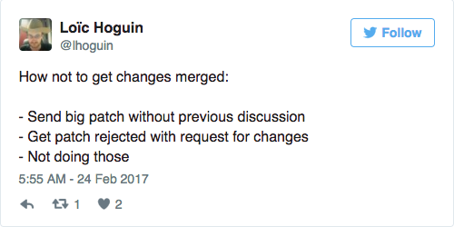
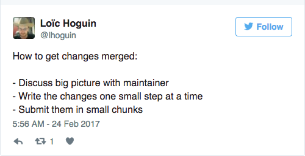
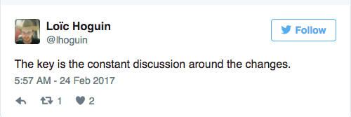
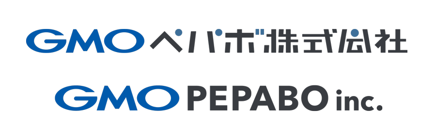

footer: Kenji Rikitake / Erlang and Elixir Factory SF Bay 2017
slidenumbers: true

# Writing A New Erlang/OTP Module for Beginners

<!-- Use Deckset 1.6.0, Next theme, 16:9 aspect ratio -->
<!-- target: 25 slides -->

^ Good morning!

---

# Kenji Rikitake

23-MAR-2017
Erlang and Elixir Factory SF Bay 2017
San Francisco, CA, USA
@jj1bdx

* Erlang Factory SF Bay 2010-2016 speaker for seven times, and...
* Erlang and Elixir Factory SF Bay 2017 speaker (8th year!)
* Erlang `rand` module co-creator

^ My name is Kenji Rikitake. I'm very glad to come back here again. This is my eighth presentation at the San Francisco Erlang and Elixir Factory since 2010.

---

# What I did for OTP

## Wrote Erlang PRNG code
## Tested and published the results
## Put the code into OTP

^ I've written six implementations of random number code for Erlang since July 2010. They're all on GitHub. I've tested and published the results at many places, including past years of this conference, and at ACM Erlang Workshops. After doing this for nearly 5 years, the code is now a part of OTP, and the first major revision will be available at OTP 20.

---

# This talk is *not* about

## Algorithms
## Random numbers
## Other implementation details

^ I have already given multiple talks at Erlang Factory on the details of pseudo random number generators, their algorithms, and the implementation details. I'll be glad to answer those questions during the conference, but I will not go into the details in this presentation.

---

# This talk is about

## Development for Erlang/OTP
## Working with OTP Team
## How to gain support of your code

^ In this talk, I will explain what I've learned from writing an Erlang module for the OTP. I will include three major topics: developing software for OTP, working with the OTP Team, and how to gain the community support of your code.

---

# Development for Erlang/OTP

^ I'd like to talk about software development for Erlang/OTP.

---

# Writing a new Erlang/OTP module

* Is the module or new code really needed in OTP?
* Who needs the new code?
* Removing old code from OTP is hard

---

# Working with OTP Team

---

# How to gain support of your code

---

[Tweet from Loïc Hoguin (@lhoguin at Twitter)](https://twitter.com/lhoguin/status/834869334174466048)

^ I'm going to show you a couple of tweets from Loïc Hoguin, the author of Cowboy, telling tips on getting your patches or pull requests merged. The first one tells that sending a large patch abruptly without a thorough discussion beforehard will always be rejected.

---

[Tweet from Loïc Hoguin (@lhoguin at Twitter)](https://twitter.com/lhoguin/status/834869569382715394)

^ The second tweet tells that having a discussion of the broader goals with the maintainer beforehand and sending patches in small steps one at a time is a key to successfully merge your patches.

---

[Tweet from Loïc Hoguin (@lhoguin at Twitter)](https://twitter.com/lhoguin/status/834869820042645504)

^ And this last tweet tells that constantly discussing around the changes is the key for a successful communication on software development.

---

# [fit] Support for this presentation is provided by

# [fit] Pepabo R&D Institute, GMO Pepabo, Inc.

^ I'd like to thank GMO Pepabo for supporting this presentation as a research activity of Pepabo R&D Institute, where I'm working as a guest researcher.

---

# Acknowledgment

* Dan Gudmundsson - rand module principal developer
* Sebastiano Vigna - [Xorshift\*/+](http://xoroshiro.di.unimi.it/) inventor
* Erlang Solutions

^ I'd like to thank Dan Gudmundsson as the OTP Team maintainer of the rand module. Sebastiano Vigna provided the Xorshift+ algorithm optimized for Erlang VM. Erlang Solutions has given me many chances of talking about this topic. 

---

# [fit] Thank you

# [fit] Questions?

^ Thank you!

---

Photo credits:

* Title slide: Davide Ragusa, from Unsplash.com
* My face: Yutaka Sakurai, Naoki Sakurai
* "This talk is not about" slide: Markus Spiske, from Unsplash.com
* "Thank you" slide: Chris Brignola, from Unsplash.com

<!-- Local Variables: -->
<!-- coding: utf-8 -->
<!-- End: -->
