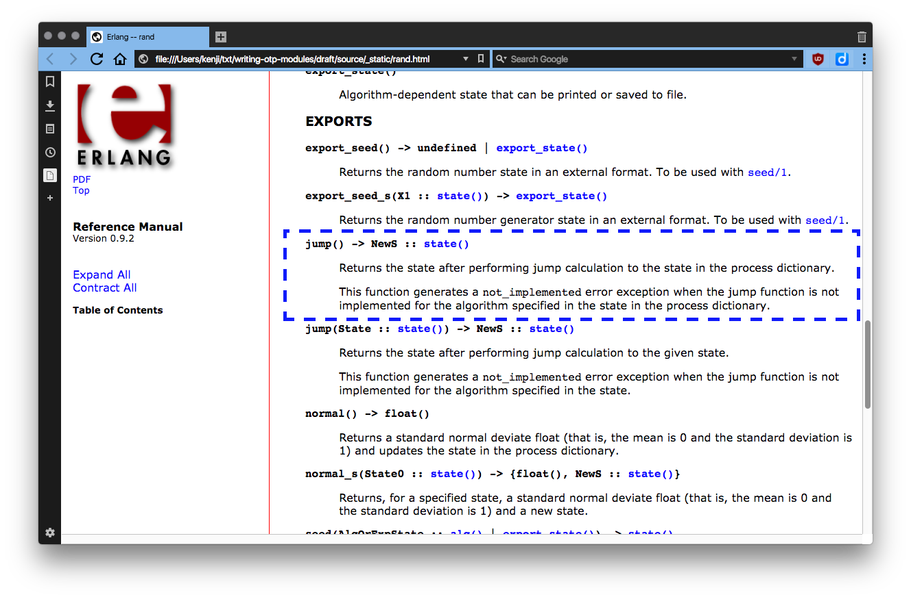

footer: Kenji Rikitake / Erlang and Elixir Factory SF Bay 2017
slidenumbers: true


# Writing A New Erlang/OTP Module for Beginners

<!-- Use Deckset 1.6.0, Next theme, 16:9 aspect ratio -->
<!-- target: 25 slides -->

^ Good morning!

---

# Kenji Rikitake

23-MAR-2017
Erlang and Elixir Factory SF Bay 2017
San Francisco, CA, USA
@jj1bdx

* Erlang Factory SF Bay 2010-2016 speaker for seven times, and...
* Erlang and Elixir Factory SF Bay 2017 speaker (8th year!)
* Erlang `rand` module co-creator


^ My name is Kenji Rikitake. I'm very glad to come back here again. This is my eighth presentation at the San Francisco Erlang and Elixir Factory since 2010.

---

# What I did for OTP

## Wrote Erlang PRNG code
## Tested and published the results
## Put the code into OTP

^ I've written six implementations of random number code for Erlang since July 2010. They're all on GitHub. I've tested and published the results at many places, including past years of this conference, and at ACM Erlang Workshops. After doing this for nearly 5 years, the code is now a part of OTP, and the first major revision will be available at OTP 20.

---


# This talk is *not* about

## Algorithms
## Random numbers
## Other implementation details

^ I have already given multiple talks at Erlang Factory on the details of pseudo random number generators, their algorithms, and the implementation details. I'll be glad to answer those questions during the conference, but I will not go into the details in this presentation.

---

# This talk is about

## Development for Erlang/OTP
## Working with OTP Team
## Gaining support for your code

^ In this talk, I will explain what I've learned from writing an Erlang module for the OTP. I will include three major topics: developing software for OTP, working with the OTP Team, and how to gain the community support of your code.

---

# Development for Erlang/OTP

^ I'd like to talk about software development for Erlang/OTP.

---

# WARNING

## Don't try commiting code only for nurturing your ego or just for your own fame, please

^ There's one thing I need to mention before getting into the details. I've observed that quite a lot of people write software for their psycological need for approval, and for their own fame. It is a bad approach for writing open source software, and often becomes destructive to the project. So don't do it.

---

# Why new code?

## Bugfix/security
## New features
## "Fix what I don't like"

^ There are many reasons for writing a new piece of code. The most critical one is for fixing a bug and closing the security holes. And people want new features, or invent some cool stuff. Some people want to change what they don't like.

---

# Do you have to change OTP?

## OTP is for *all* Erlang users
## Who needs new code?
## Once committed, removal is hard

^ You need to think carefully before trying to change the OTP. OTP is for all Erlang users, including the Elixir and other language users, so changing it may affect many people. You also need to think about who needs the code. If the code is a critical security fix it'll be accepted in short time, but if it's a new feature more design discussion will be needed. And you need to remember, once code is committed, removing it is a very difficult task.

---

# [fit] Rationale for `rand` module

* **`random` module period is too short and exploitable within <10 hours with a modern desktop computer, so it's basically a security fix**
* **Fixing API: eliminating the need for initialization**
* **New features: selecting multiple algorithms, normal distribution generator, jump functions from OTP 20**

^ The rational for including rand module was mainly to fix the security issues of random module. The random module is exploitable within less than 10 hours. Eliminating the need for initialization is an improvement for the API. Selecting multiple algorithms and providing normal distribution generator are already available as the new features. From OTP 20 you will be able to use the jump functions too. The important point is that you need to have a rationale that can convince all users of Erlang.

---

# Prototyping

## Independent repository
## Common Test and Dialyzer
## Learn erl_docgen

^ When you decide to write your own Erlang module, the first thing you need to do is to make an independent repository. Isolating code under development from existing systems will make the testing easier. You also need to learn Common Test, which is the default testing framework for OTP, and Dialyzer, to provide function and data type specifications. You also need to be fluent in erl_docgen, which is an XML-based documentation system.

---

# erl_docgen document example

```xml
<func>
  <name name="jump" arity="0"/>
  <fsummary>Return the seed after performing jump calculation
      to the state in the process dictionary.</fsummary>
  <desc><marker id="jump-0" />
      <p>Returns the state
          after performing jump calculation
          to the state in the process dictionary.</p>
  <p>This function generates a <c>not_implemented</c> error exception
       when the jump function is not implemented for
       the algorithm specified in the state
       in the process dictionary.</p>
  </desc>
</func>
```

^ This is an erl_docgen document example taken from the rand module document. It's neither a Markdown nor an HTML. 

---



^ This an an example of HTML page rendered from the erl_docgen document.

---

# Working with OTP Team

^ Now I'd like to talk about how to work with OTP Team.

---

# Let me show you some excellent tweets from the author of Cowboy HTTP server

^ I'm going to show you a couple of tweets from Loïc Hoguin, the author of Cowboy, telling tips on getting your patches or pull requests merged, on February 2017.

---

[Tweet from Loïc Hoguin (@lhoguin at Twitter)](https://twitter.com/lhoguin/status/834869334174466048)


^ The first one tells that sending a large patch abruptly without a thorough discussion beforehard will always be rejected.

---

[Tweet from Loïc Hoguin (@lhoguin at Twitter)](https://twitter.com/lhoguin/status/834869569382715394)


^ The second tweet tells that having a discussion of the broader goals with the maintainer beforehand and sending patches in small steps one at a time is a key to successfully merge your patches.


---

[Tweet from Loïc Hoguin (@lhoguin at Twitter)](https://twitter.com/lhoguin/status/834869820042645504)


^ And this last tweet tells that constantly discussing around the changes is the key for a successful communication on software development.

---

# What to include in a GitHub PR

* **What you are going to do with the PR**
* **How the PR changes the behavior of the code**
* **What and how the changes will and *will not* affect the other modules and applications**
* **Common Test cases** and **type specifications**
* **Documentation**

^ When you are going to issue a pull request or a PR, you need to tell what you are going to do with it and how it changes and affects or does not affect the other modules. You also need to include the Common Test cases and the type specifications, and the documentation.

---

# What to do when issue a PR

* **Report the bug before submitting a bugfix PR**
* **Choose the right branch**
* **Separate commits for separate changes**
* **Make sure that each commit can be compiled**
* **Make sure that each commit works**
* **Use `git rebase` so that OTP Team can `git bisect`**

^ For a bugfix PR, a bug report must be issued. You also need to choose the right branch, which is the master branch for new features, while the maint branch will be appropriate for a bugfix to a release. You need to issue separate commits for separate changes, and each commit in a PR should be able to be compiled and work well. This is a requirement so that OTP Team can use the git bisect command. OTP Team may request you to squash multiple commits, so you need to get accustomed to use git rebase.

---

# Communication with OTP Team

* **Choose the GitHub Issues and private email wisely**
* **OTP Team are working in Central *European* Time Zone**
* **In Europe, DST is different from USA/Canada**
* **OTP Team have their weekends, holidays, and vacations**
* **Don't expect a prompt reply during non-working hours**
* **OTP Team members have to handle multiple modules**

^ Maintaining steady communication with the OTP Team is very important. They may send you some private email, so use them wisely. They are also in Sweden, so the time zone and the daylight saving time schedule is different from USA. They have their weekends and holidays because OTP Team members have to deal with Erlang/OTP as their duty and business. So don't expect a prompt reply in non-working houts. Also, each OTP Team member has to handle multiple pieces of software, so time for you is usually limited.

---

# How to gain community support for your code

^ Let me move on to how to gain community support for your code.

---

# Promote your code

* **Publish ready-to-use modules on GitHub and elsewhere**
* **`rand` module have *six* related modules released**
* **Give talks and publish papers on conferences**
* **Write a PoC and show what the problem is**

^ For earning the community support, promoting your code is essential. Publishing ready-to-use modules is effective for obtaining feedbacks from other developers. Rand module have six related published modules. Giving talks and publishing papers on conferences are also effective. Rand module have six presentations in major conferences, workshops, and meetups. If your code is related to a security issue, writing a proof-of-concept code and showing the problem will help convincing OTP Team to understand the severity of the issue.

---

# Code maintenance and support

* **When your code is in OTP you are responsible as the same as the OTP maintainers for the part of the code**
* **You are expected to contribute a further enhancement or a new feature when they are available**
* **Old code may be deprecated and removed**
* **Adding new features should be done _very carefully_**

^ When you add a module to Erlang/OTP, that means you are also responsible for maintaining the module, especially when the security issues or vulnerabilities are found. You have no legal duty but are supposed to provide a help when it is requested by the OTP Team. you are also expected to contribute a further enhancement or a new feature when they are available. An unmaintained piece of code will be deprecated and removed from OTP by the OTP Team's discretion. Also, OTP Team generally takes conservative approach to change,s o you need to be careful on adding a new feature to an existing module.

___

# Licenses for Erlang/OTP

* **Erlang/OTP: Apache License 2 (APLv2)**
* **APLv2: *inconpatible* with GPLv2 and GPLv3**
* **MIT and BSD License code can be easily incorporated**
* **Your code may need to be relicensed to OTP Team**
  - The copyright notice is limited in simple manners

^ Erlang/OTP has been licensed under Apache License 2.0 since OTP 18. Mixing source code which has other licenses than Apache License 2.0 should be done carefully. For example, software under GNU Public License (GPL) cannot be directly linked to Erlang/OTP, due to the license compatiblity with Apache License 2.0. ncluding MIT and BSD license code in Erlang/OTP does not require any special process. You may need to relicense your code to OTP Team. OTP Team will let you know the details on the exact conditions before merging your code, so that the legal issues will be cleared.

---


# OTP needs your help

## [fit] Your contribution is always welcome

^ To conclude this presentation, I would like to emphasize that the Erlang community and OTP Team always need your help to fix the bugs and improve the software. I'd be glad if this presentation helps you to understand how the Erlang/OTP is maintained and how the project is governed.

---

# References

* [My WIP document: Writing OTP Modules](http://docs.jj1bdx.tokyo/writing-otp-modules/html/index.html)
* [Source of Writing OTP Modules](https://github.com/jj1bdx/writing/otp-modules)

^ I've written a work-in-progress document regarding this presentation called Writing OTP Modules. Your feedback to the document is highly welcome.

---

# [fit] Support for this presentation is provided by


# [fit] Pepabo R&D Institute, GMO Pepabo, Inc.

^ I'd like to thank GMO Pepabo for supporting this presentation as a research activity of Pepabo R&D Institute, where I'm working as a guest researcher.

---

# Acknowledgment

* Dan Gudmundsson - rand module principal developer
* Sebastiano Vigna - [Xorshift\*/+](http://xoroshiro.di.unimi.it/) inventor
* Erlang Solutions

^ I'd like to thank Dan Gudmundsson as the OTP Team maintainer of the rand module. Sebastiano Vigna provided the Xorshift+ algorithm optimized for Erlang VM. Erlang Solutions has given me many chances of talking about this topic. 

---


# [fit] Thank you

# [fit] Questions?

^ Thank you!

---

[.autoscale: true]

Photo credits:

* Title slide: Davide Ragusa, from Unsplash.com
* Kenji Rikitake's face: Yutaka Sakurai and Naoki Sakurai, taken in front of USS Pampanito at Pier 45, San Francisco, CA, USA, March 2015
* "This talk is not about" slide: Markus Spiske, from Unsplash.com
* "OTP needs your help" slide: Matheus Ferrero, from Unsplash.com
* "Thank you" slide: Chris Brignola, from Unsplash.com

(All Unsplash.com photos are licensed under Creative Commons CC0 License)

<!-- Local Variables: -->
<!-- coding: utf-8 -->
<!-- End: -->
