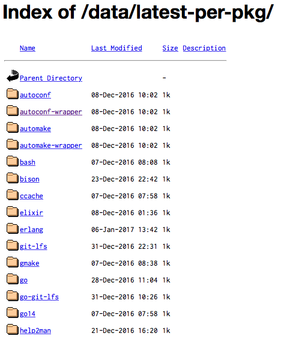
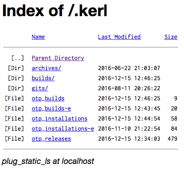

footer: Kenji Rikitake / ErLounge SF 23-MAR-2017
slidenumbers: true

<!-- Use Deckset 1.6.0, theme: Next, 16:9 aspect ratio -->

# plug\_static\_ls: directory listing module for Plug/Phoenix

Kenji Rikitake
Kenji Rikitake Professional Engineer's Office / Pepabo Labs
23-MAR-2017
@jj1bdx
Erlang and Elixir Factory SF Bay 2017 ErLounge Lightning Talk

---


# [fit] Hello!

## [fit] Erlang/OTP since 2008

## [fit] Elixir since 2015

## [fit] Pepabo Labs

## [fit] Web dev/op/research

---



# [fit] Directory Listing?

## [Yaws](http://yaws.hyber.org/) example ->

## Providing directory listing of static assets/files

**This is easy on Apache, Nginx, and Yaws, but - Phoenix or Plug doesn't have this module**

^ Directory listing is an old function which is ready-to-use on Apache, Nginx, and Yaws. This is a Yaws screen. Implementing this, however, requires an independent application for Phoenix, or Plug. I needed this for one of my projects, so I had to implement something.

---

# A new Plug module plan

Phoenix uses **Plug.Static** for the static contents

* Map a URI path to a directory (with access control)
* If the specified file is found it is sent with MIME type
* If the file is not found, control is transferred to next Plug -> **Adding a module listing the directory looks promising**

^ Plug has already a Plug.Static module for serving the static contents. What I need now is a Plug module for providing directory listing.

---

# [fit] Any similar modules?
# [fit] ... Not found

---

# [fit] If you don't find a module
# [fit] Build it by yourself

---

# Writing from scratch is hard

If you find a directory, following tasks are needed:

* Get directory listing (with an arbitrary sort function)
* Pick up the sort algorithm identifier from GET query parameter
* Get file attributes and show them
* Keep the chosen sort algorithm in the URL

^ To serve a directory listing, you need to do this: get the listing, sort it, and show it. You need to keep the collation or sort sequence of the list as a state inside the URL.

---

# Result: plug\_static\_ls

* Module name: **PlugStaticLs**
* Configure the endpoint like this:

```elixir
plug Plug.Static, at: "/static",
  from: "/files", gzip: false,
  only: ~w(images public js css)
plug PlugStaticLs, at: "/static",
  from: "/files"
  only: ~w(images public)
# Error handling required for the fall-through URIs
```

^ So I've written plug\_static\_ls. This is an example endpoint configuration. Note well that you have to put the Plug.Static module before PlugStaticLs.

---



# plug\_static\_ls screen

**Consuming considerable CPU time** (5ms to 500ms) - not suitable for the public use

Icons files can be shown as Base64 img binaries, but dropped from the module release kit to prevent duplicated images

The screen looks like Yaws, anyway

^ This is an example screen for plug\_static\_ls. I decided to eliminate icons, because serving them required the own directory for the icons. This screen looks like Yaws, anyway.

---

# plug\_static\_ls
## [fit] <https://hex.pm/packages/plug_static_ls>
## [fit] <https://github.com/jj1bdx/plug_static_ls>

^ You can find plug\_static\_ls in Hex and in GitHub.

---

# [fit] Thank you

<!-- Local Variables: -->
<!-- coding: utf-8 -->
<!-- End: -->
